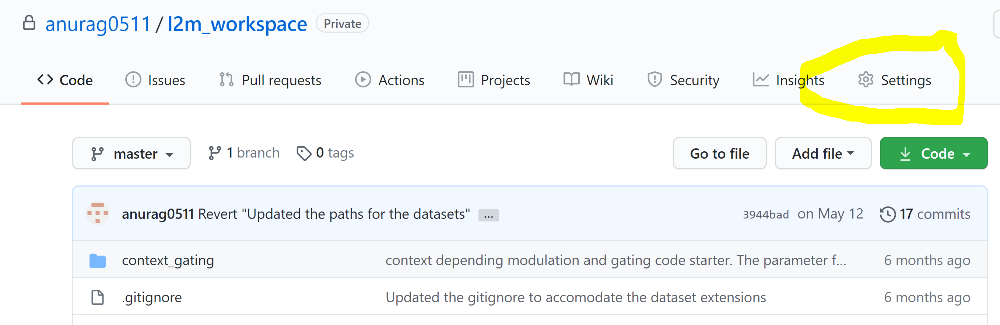
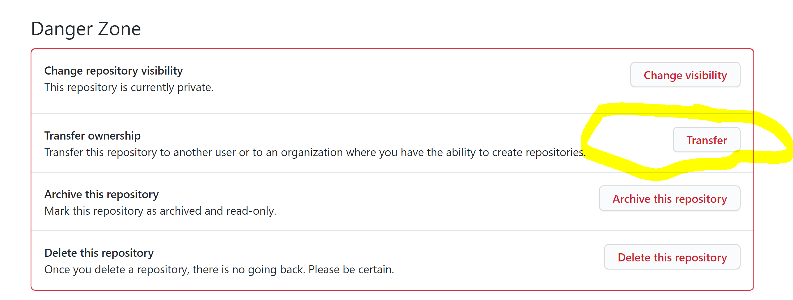
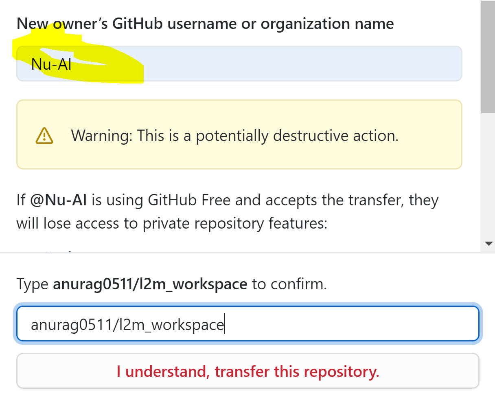
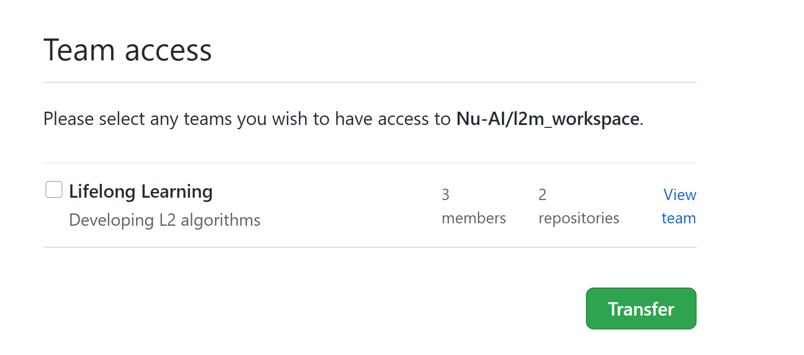

# Setting up git 
Neurons, here are some tips and tricks for maintaining everything seamlessly on a [VCS ( Version Control System )](https://www.geeksforgeeks.org/version-control-systems/#:~:text=Version%20control%20systems%20are%20a,(snapshots)%20of%20the%20project.) like github which uses git. So, if you are a bit confused over how to use git, no worries 
you can contact [me](https://github.com/anurag0511) anytime.
# Tutorials
and here is a very good [resource](https://githowto.com/) or you could watch the video [here](https://www.youtube.com/watch?v=USjZcfj8yxE) for you to learn using git (#tutorials). Believe me, its confusing at the beginning but is very easy and will make your life 100x easier once you get used with it. 

If you already have your repo, then just transfer it here and it is recommended to rename the repo in the aforementioned format before transferring. 

- Go to settings in your personal repo.
    
- Scroll down to the `Danger Zone` area.
    
- Select the `Transfer` option.
- Type `Nu-AI` in the organization name.
    
- You will be redirected to a page as shown below. You can ignore the Teams option and select 'Transfer' option.
    
- Voila!!, it will be transferred. :grinning:

So, if you are wondering what might happen to your `git origin` path, on your system. Do not worry, it does it automatically and might nag you a bit to change the origin.
So, in that case just follow this.

```bash
$ git remote rm origin
$ git remote add origin git@github.com:repo_name.git
```
So, the first command removes the current origin path and the next command is used to reset the origin path to the new data. If you don't know what origin is, then please go back and look at the [tutorials](#tutorials) above.

Now, I know I already gave you guys a task, but I have to give you guys one more task. I am sorry, no more tasks after this, I promise.
 
 
 So, you see I am writing all this in a writing language called [Markdown](https://www.markdownguide.org/). It is simpler than LaTeX, and is very easy to learn. Here is a [resource](https://guides.github.com/features/mastering-markdown/) for that. Please go through that also. 
 
 So, as for the repository structure, I will elaborate it here once again. Organize it this way, neat things look better. 
 
 
 Root
+ Scripts ( Have any of your simple or hacky scripts here )
+ Project_name ( Any project that you would have worked on or currently working on )
    + Sub project folder
    + Data ( Usually not receommended for larger sets but if you want to save some on git, then keep it separate )
    + Images ( Can have your saved plots or other images )
    + Scripts/ Module names
    + .gitignore ( if you want to, not necessary )
    + README
+ .gitignore
+ requirements.txt
+ README

So, let me tell you a little about `.gitignore`. This file is meant to prevent us from adding some certain type of files to git. We can select the extension, also folder paths if it is in the source directory, and lets you add only required stuff to your repo. It is recommended to not put log files, datasets or any other intermediate generated files on your repo.
`requirements.txt` consists of all the packages that need to be installed for running the code that you posted. A easy way to make this text file is by installing `pipreqs`
```bash
pip install pipreqs
```
Do this to install pipreqs and then just simply do this.
```
pipreqs /YOUR_DIRECTORY
```
or 
if you are in the current project directory, then 
```
pipreqs ./
```
Making a requirements file is optional but is helpful if you create one for others to use. I recommend having this in shared repos.
